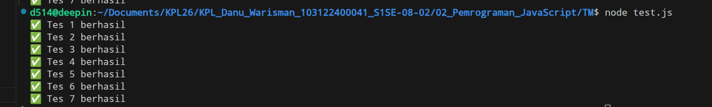

# Tugas Mandiri 02: Pemrograman JavaScript

Buatlah sebuah fungsi bernama fizzBuzz yang menerima input larik (array) dan mengembalikan deretan bilangan dan "Fizz" untuk kelipatan 2, "Buzz" untuk kelipatan 7, dan "FizzBuzz" untuk kelipatan 14. Beri nama berkas program sebagai tm.js dan taruh di direktori TM.

Contoh:

```text
Input:
[8, 9, 32, 75, 84]

Output:
Fizz 9 Fizz 75 FizzBuzz

```

**Output :**


**Penjelasan:**

Di kode bawaan modul fungsi 'fizzBuzz' itu isinya cuma hardcode return '"Fizz 9 Fizz 75 FizzBuzz"'. Kalau dibiarin gitu ya pasti cuma lolos di Tes 1 aja karena input tes yang lain beda-beda. Terus parameter bawaannya yang namanya 'params' aku ganti jadi 'arr` biar lebih jelas aja kalau input yang masuk itu harus berupa array.

Makanya kodingannya dirombak pake perulangan 'for' buat ngecek isi array-nya satu-satu. Buat nentuin katanya, pake 'if else' dan modulus ('%`). Urutan ngeceknya harus dari angka paling besar (14) dulu, baru 7, terus 2, biar angka kayak 14 gak keburu masuk ke kondisi kelipatan 2.

Sesuai tip di soal, di sini pake operator penyambungan string ('+=') buat gabungin kata. Nah, biar spasinya rapi dan gak ada spasi lebih di akhir kalimat, aku tambahin kondisi `if (i < arr.length - 1)'. Jadi spasinya cuma ditambahin kalau itu bukan angka terakhir.

Terakhir, ada *test case* yang minta output '"Input tidak valid"' kalau inputnya bukan array. Buat ngakalin ini, aku tambahin validasi di paling awal fungsi pake 'if (!Array.isArray(arr))'. Jadi kalau input yang masuk aneh-aneh (bukan array), program langsung me-return pesan error sesuai permintaan `test.js'.
