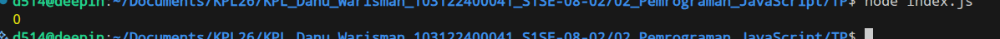
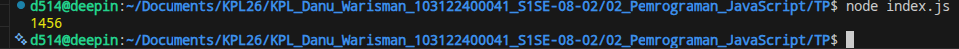

# Tugas Pendahuluan 02: Pemrograman JavaScript
**Soal**

Kamu sudah menulis fungsi mulOfArray. Ujilah dengan input [2, 0, 26, 28, -2], dengan output yang seharusnya adalah 1456. Jika kamu menemukan bahwa hasilnya berbeda, bisakah kamu memperbaikinya? Jika kamu menemukan bahwa hasilnya sama, bisakah kamu menjelaskan mengapa demikian?

**Kode sumber**

Tersedia di [index.js](./index.js)

**Output 1**

**Output 2**

**Deskripsi Program**

Program berfungsi untuk mengalikan semua bilangan positif yg ada di dalam array.
Saat menguji kode bawaan modul dengan input '[2. 0, 26, 28, -2]'. hasil yg keluar adalah '0'

Penyebab : 'if (arr[i]>=0)' karena ada tanda sama dengan ('='), angka '0' jadi menuhin syarat dan ikut keproses. SEHINGGA SAAT MENGALIKAN SEMUA VARIABLE AKAN OTOMATIS '0'

Perbaiki : hapus '=' nya dari 'if(arr[i]>=0)' jadi 'if(arr[i]>0)' 

Dengan ini '0' dan '-2' akan otomatis dilewati. program jadi hanya mengalikan angka yg nilainya >0 yaitu 2, 26,dan 28. hasilnya pun jadi '1456'
