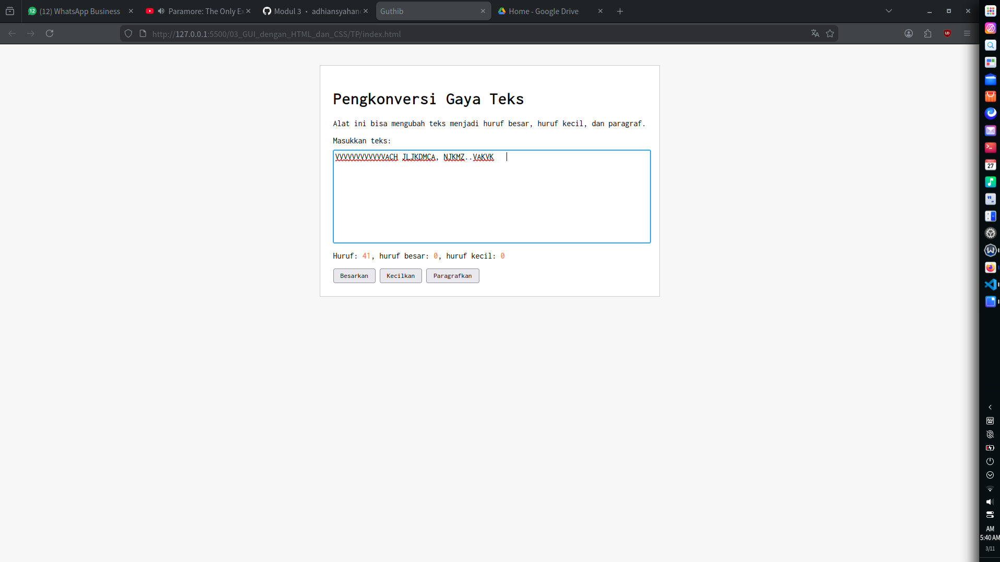

# Tugas Pendahuluan: Pemrograman GUI dengan HTML dan CSS
**Nama :** Danu Warisman  
**NIM  :** 103122400041  
**Kelas:** SE-08-02

**Soal**

Buatlah tata letak laman yang kamu buat berada di tengah seperti di bawah ini, dan juga ubah font-nya dengan Inconsolata dari Google Fonts.

**Kode Sumber**

Tersedia di:
index.js
index.html
index.css

**Output**

**Deskripsi Program**

Untuk menggunakan font Inconsolata dari Google Fonts, Aku menambahkan tag link ke dalam bagian head pada file index.html:

```
<link href="https://fonts.googleapis.com/css2?family=Inconsolata&display=swap" rel="stylesheet">

```

Sedangkan untuk membuat tampilan berada di tengah layar dan mengimplementasikan font tersebut, saya membungkus seluruh elemen HTML di dalam class container-tengah dan mengaturnya di file index.css seperti ini:

```
body {
    font-family: 'Inconsolata', monospace;
    background-color: #f7f7f7;
}

.container-tengah {
    max-width: 600px;
    margin: 40px auto; 
    background-color: white;
    padding: 25px;
    border: 1px solid #ccc;
}

```

Untuk fungsionalitas aplikasi (menghitung huruf serta tombol aksi), saya menambahkan event listener pada masing-masing elemen di index.js . Berikut logika utamanya:

```
const editorElement = document.getElementById("editor-kecil");

// Ambil tombol-tombol
const btnBesar= document.getElementById("huruf-besar");
const btnKecil = document.getElementById("huruf-kecil");
const btnParagraf = document.getElementById("huruf-paragraf");

// Fungsi besarkan
btnBesar.addEventListener("click", function() {
   editorElement.value = editorElement.value.toUpperCase();
});

// Fungsi kecilkan
btnKecil.addEventListener("click", function() {
    editorElement.value = editorElement.value.toLowerCase();
});

// Fungsi paragrafkan
btnParagraf.addEventListener("click", function() {
    let teksSkrg = editorElement.value;
    
    if(teksSkrg.length > 0){
        let awal = teksSkrg[0].toUpperCase();
        let sisa = teksSkrg.substring(1).toLowerCase();
        
        editorElement.value = awal + sisa;
    }
});

```

**Penjelasan Fungsi:**

Fungsi Besarkan: Menggunakan fungsi toUpperCase() yang bertugas mengambil teks dari kotak input dan mengubah semua karakternya menjadi huruf kapital.

Fungsi Kecilkan: Sebaliknya, fungsi ini memanggil toLowerCase() untuk memastikan seluruh teks yang ada di dalam inputan berubah menjadi huruf kecil semua.

Fungsi Paragrafkan: Menggunakan teknik manipulasi teks. Logikanya adalah mengambil karakter pada urutan pertama lalu menjadikannya huruf kapital. Kemudian, sisa teksnya dipotong menggunakan fungsi substring(1) agar huruf pertamanya tidak ikut, dan langsung diubah menjadi huruf kecil dengan toLowerCase(). Terakhir, bagian awal dan sisanya digabungkan kembali.