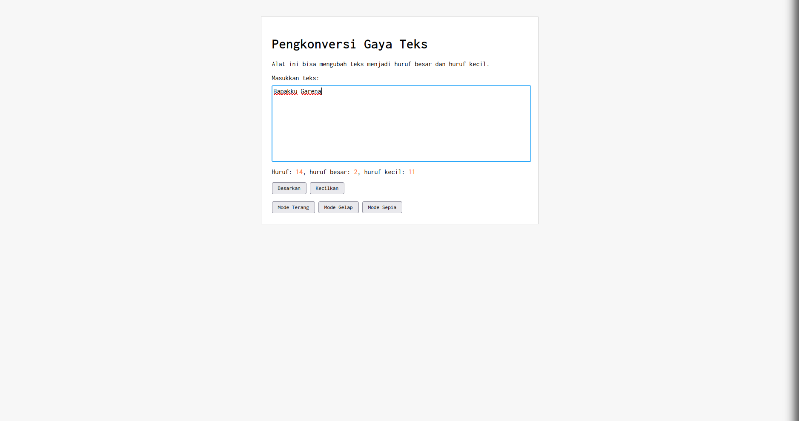
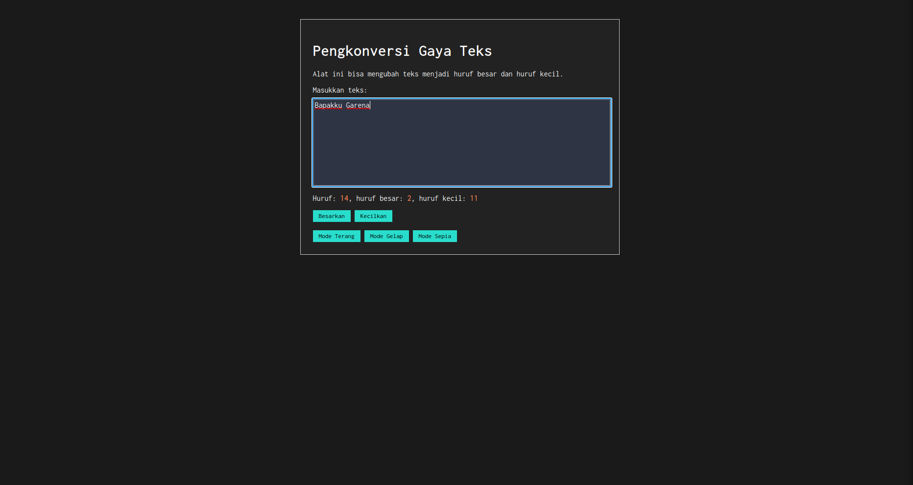
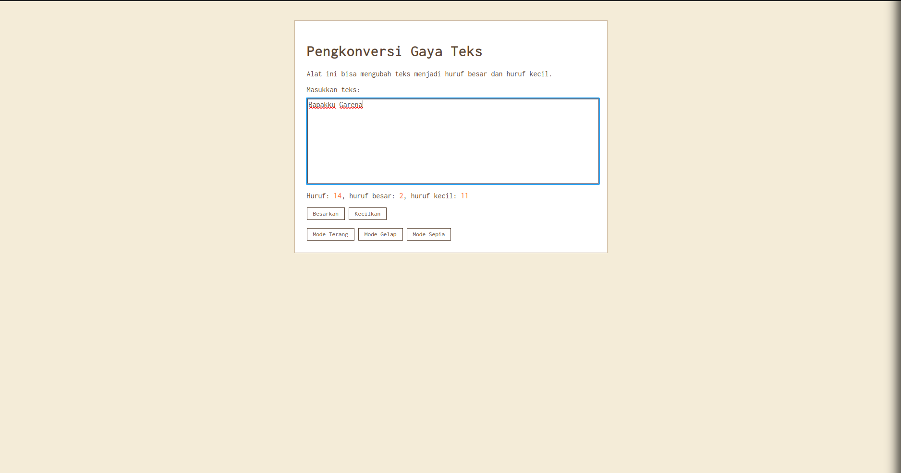

# Tugas Mandiri 04: Automata dan Table-Driven Construction

**Nama:** Danu Warisman

**NIM:** 103122400041

**Kelas:** SE-08-02

## Tugas

Tambahkan mode sepia pada aplikasi Pengkonversi Gaya Teks. Ketentuan warna untuk latar belakang halaman adalah #F4ECD8 dengan warna teks #5B4636. Sementara itu, form (container-tengah) tetap menggunakan warna latar putih.

Selain itu, bagian mode-div harus menaungi tiga tombol: light, dark, dan sepia. Perpindahan state harus berjalan secara mulus mengikuti aturan berikut: sepia menghasilkan sepia-mode, dark menghasilkan dark-mode, dan light menghasilkan light-mode.

## Program/Kode

Tersedia di [index.js](https://github.com/danuwarisman/KPL_Danu_Warisman_103122400041_S1SE-08-02/blob/main/04_Automata_dan_Table-Driven_Construction/TM/index.js), [index.html](https://github.com/danuwarisman/KPL_Danu_Warisman_103122400041_S1SE-08-02/blob/main/04_Automata_dan_Table-Driven_Construction/TM/index.html), dan [index.css](https://github.com/danuwarisman/KPL_Danu_Warisman_103122400041_S1SE-08-02/blob/main/04_Automata_dan_Table-Driven_Construction/TM/index.css).

## Output





## Deskripsi

Sesuai instruksi Tugas Mandiri modul 4, langkah pertama yang ku lakuin adalah nambahin satu tombol baru "Mode Sepia" di index.html, sekalian ngasih 'class="mode-div"` ke div yang naungin ketiga tombol tema.

```
        <div class="mode-div">
            <button id="btn-terang">Mode Terang</button>
            <button id="btn-gelap">Mode Gelap</button>
            <button id="btn-sepia">Mode Sepia</button>
        </div>
'''

Selanjutnya, di index.css, sy refactor dulu class 'tema-gelap' jadi 'dark-mode' biar namanya konsisten sama pola state yang baru. Terus sy nambahin blok aturan khusus buat 'sepia-mode`. Latar belakang halaman dikasih warna #F4ECD8, warna teksnya #5B4636, tapi container-tengah tetap dibiarkan putih sesuai ketentuan.

```css
/* mode gelap (direfactor dari tema-gelap) */
body.dark-mode {
    background-color: #1a1a1a;
}

.dark-mode .container-tengah {
    background-color: #222;
    color: white;
}

.dark-mode #editor-kecil {
    background-color: #2e3443;
    color: white;
}

.dark-mode button {
    background-color: #29ddcc;
    border: none;
}

/* mode sepia */
body.sepia-mode {
    background-color: #F4ECD8;
    color: #5B4636;
}

.sepia-mode .container-tengah {
    background-color: white;
    color: #5B4636;
    border-color: #c9b49a;
}

.sepia-mode #editor-kecil {
    background-color: white;
    color: #5B4636;
}

.sepia-mode button {
    background-color: white;
    color: #5B4636;
    border: 1px solid #5B4636;
}
```

Nah, biar perpindahan antar mode bisa jalan mulus, sy ubah logika di index.js. Daripada pakai 'classList.add' dan 'classList.remove' secara terpisah kayak sebelumnya, sekarang sy bikin satu fungsi 'gantiMode()` yang kerjanya ngehapus semua class mode dulu baru nambahin yang baru. Ini biar nggak ada dua class mode aktif sekaligus.

`''js
const semuaMode = ["light-mode", "dark-mode", "sepia-mode"];

function gantiMode(modeBaru) {
    semuaMode.forEach(function(mode) {
        document.body.classList.remove(mode);
    });
    document.body.classList.add(modeBaru);
}

const tombolTerang = document.getElementById("btn-terang");
const tombolGelap = document.getElementById("btn-gelap");
const tombolSepia = document.getElementById("btn-sepia");

tombolTerang.addEventListener("click", function() {
    gantiMode("light-mode");
});

tombolGelap.addEventListener("click", function() {
    gantiMode("dark-mode");
});

tombolSepia.addEventListener("click", function() {
    gantiMode("sepia-mode");
});
```

Pas ngeklik salah satu tombol, fungsi 'gantiMode()' bakal dipanggil dengan nama mode yang sesuai. Fungsinya bakal looping dulu ke semua class mode yang ada dan nyopot semuanya dari tag body, baru setelah itu nambahin class yang baru. Jadi kalau lagi di dark-mode terus klik "Mode Sepia", class 'dark-mode' bakal dihapus dan 'sepia-mode` langsung dit