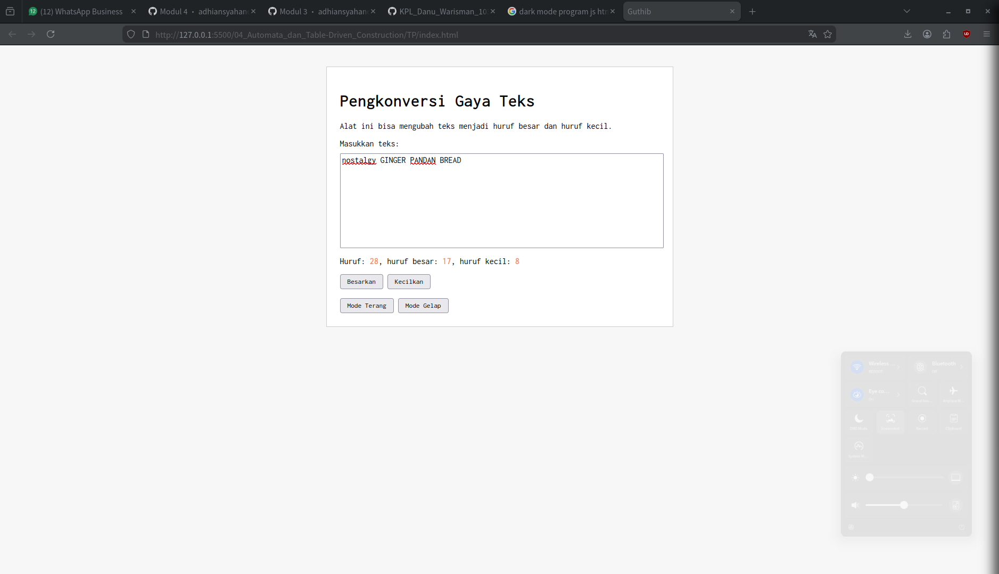
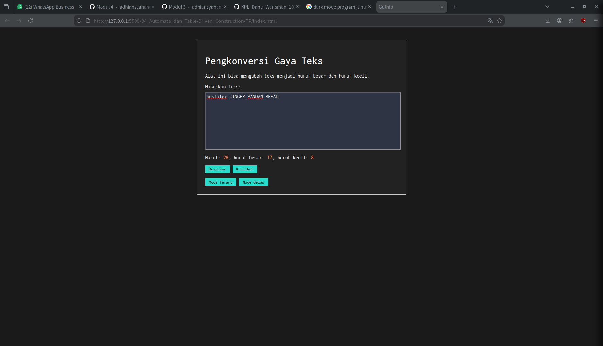

# Tugas Pendahuluan 04: Automata dan Table-Driven Construction

**Nama:** Danu Warisman

**NIM:** 103122400041

**Kelas:** SE-08-02

## Tugas

Tambahkan mode gelap sekaligus untuk editor-kecil dan tombol-tombolnya. Ketentuan warna untuk latar belakang editor-kecil adalah #2e3443, sementara untuk tombol adalah #29ddcc. Teks untuk tombol tetap mengikuti warna teks sebelumnya.

Untuk menghapus pinggiran tombol, nyatakan properti border untuk tidak ditunjukkan.

## Program/Kode

Tersedia di [index.js](https://github.com/danuwarisman/KPL_Danu_Warisman_103122400041_S1SE-08-02/blob/main/04_Automata_dan_Table-Driven_Construction/TP/index.js), [index.html](https://github.com/danuwarisman/KPL_Danu_Warisman_103122400041_S1SE-08-02/blob/main/04_Automata_dan_Table-Driven_Construction/TP/index.html), dan [index.css](https://github.com/danuwarisman/KPL_Danu_Warisman_103122400041_S1SE-08-02/blob/main/04_Automata_dan_Table-Driven_Construction/TP/index.css).

## Output




## Deskripsi

Sesuai instruksi Tugas Pendahuluan modul 4, langkah pertama yang ku lakuin adalah nambahin dua tombol baru di index.html buat pemicu ganti tema dari terang ke gelap.

```
<div>
    <button id="btn-terang">Mode Terang</button>
    <button id="btn-gelap">Mode Gelap</button>
</div>

```

Selanjutnya, pada index.css, sy bikin aturan khusus yang cuma aktif kalau tag body dikasih class tema-gelap. Di sini sy sekalian ngatur warna background kotak input sama warna tombolnya.


```
/* tambahan buat mode gelap */
body.tema-gelap {
    background-color: #1a1a1a;
}

.tema-gelap .container-tengah {
    background-color: #222;
    color: white;
}

.tema-gelap #editor-kecil {
    background-color: #2e3443;
    color: white;
}

.tema-gelap button {
    background-color: #29ddcc;
    border: none;
}

```

Nah, biar tombolnya bisa dipencet dan beneran ganti tema, tambahkan logika DOM di index.js pake event listner:

```
const tombolTerang = document.getElementById("btn-terang");
const tombolGelap = document.getElementById("btn-gelap");

tombolGelap.addEventListener("click", function() {
    document.body.classList.add("tema-gelap");
});

tombolTerang.addEventListener("click", function() {
    document.body.classList.remove("tema-gelap");
});

```

Pas ngeklik tombol "Mode Gelap", program bakal jalanin perintah classList.add("tema-gelap"). Ini fungsinya buat nempelin class CSS baru ke dalam tag body, jadinya semua elemen web bakal langsung berubah warnanya ngikutin aturan yang baru.

Sebaliknya, kalau ngeklik tombol "Mode Terang", program bakal jalanin classList.remove("tema-gelap"). Ini fungsinya buat nyopot class tersebut dari tag body, biar tampilannya balik lagi bersih ke mode terang bawaannya.