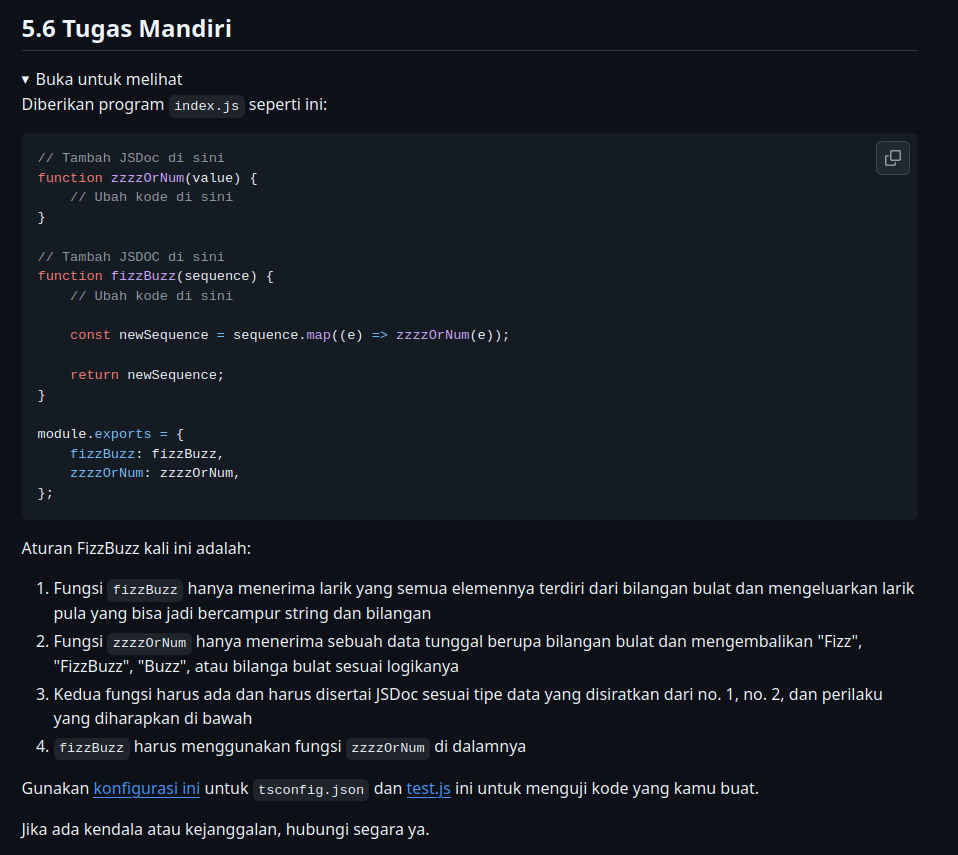
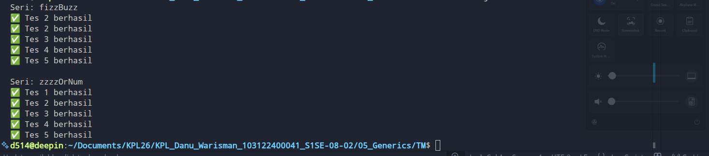
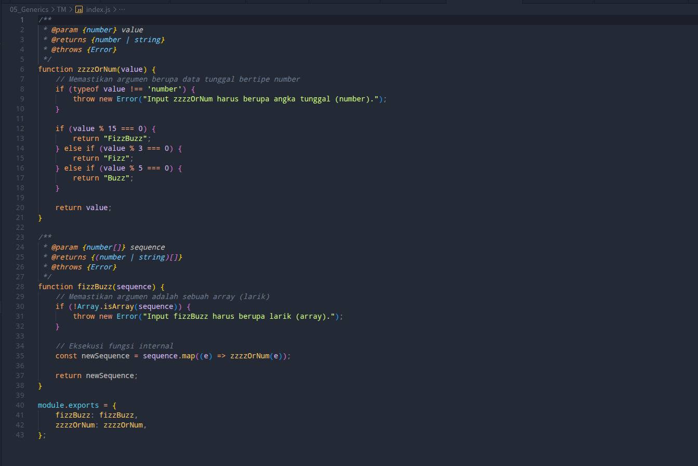

# Tugas Mandiri 5 : Generics

**Nama:** Danu Warisman

**NIM:** 103122400041

**Kelas:** SE-08-02

## Tugas

## Program/Kode

Tersedia di [index.js](https://github.com/danuwarisman/KPL_Danu_Warisman_103122400041_S1SE-08-02/blob/main/05_Generics/TM/index.js) dan [test.js](https://github.com/danuwarisman/KPL_Danu_Warisman_103122400041_S1SE-08-02/blob/main/05_Generics/TM/test.js).

## Output

## Deskripsi

Karena "output" dari fungsinya bisa berupa teks atau angka, saya menggunakan "union type" berupa "number" atau "string" untuk "return value" nya.

Pada berkas pengujian, terdapat asersi yang sengaja memasukkan tipe data yang salah untuk memicu "error", seperti mengirim "array" kosong ke fungsi "zzzzOrNum" atau mengirim angka tunggal ke fungsi "fizzBuzz". Agar dapat lolos pengujian tersebut, saya menambahkan validasi di awal masing-masing fungsi untuk melempar "throw new Error" jika inputnya tidak sesuai. Validasi ini dilakukan dengan mengecek "typeof value" untuk memastikan inputnya berupa "number", serta menggunakan "Array.isArray" untuk memastikan inputnya berupa larik.

Terakhir, untuk inti logika "fizzbuzz", urutan pengecekan bersyarat dibuat menggunakan modulo 15 terlebih dahulu, baru kemudian dilanjutkan dengan modulo 3 dan 5. Hal ini dilakukan agar angka yang dapat dibagi 3 dan 5 sekaligus tidak salah diproses dan hanya menghasilkan "fizz" saja.
.