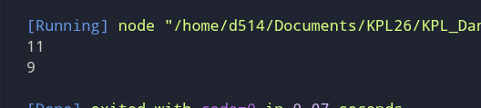

# Tugas Pendahuluan 5 : Generics

**Nama:** Danu Warisman

**NIM:** 103122400041

**Kelas:** SE-08-02

## Tugas
Buka untuk melihat

Ini adalah kode yang mengurus jumlah semua karakter dan jumlah huruf:
```
const str = "Bar bar";

let jumlahSemua = 0;
for (const c of str) { 
    jumlahSemua++; 
}
console.log(total);

let jumlahHuruf = 0;
for (const c of str) { 
    if (c === ' ') continue;
    jumlahHuruf++;
}
console.log(letters);
```

Bagaimana caramu hanya dengan satu fungsi generik bisa mengurus keduanya?

Agar fungsi yang kamu kerjakan benar atau tidak, berikut ini adalah kode tes yang bisa kamu tempelkan:

```
const str = "Bar bar bar";
...
console.log(
   hitung(str, "semua") // Harusnya 11
);

console.log(
  hitung(str, "huruf") // Harusnya 9
);

hitung(str, "huruf"); // Tidak terjadi apa-apa
```

## Program/Kode

Tersedia di [index.js](https://github.com/danuwarisman/KPL_Danu_Warisman_103122400041_S1SE-08-02/blob/main/05_Generics/TP/index.js) dan [test.js](https://github.com/danuwarisman/KPL_Danu_Warisman_103122400041_S1SE-08-02/blob/main/05_Generics/TP/test.js).

## Output


## Deskripsi

Saya bikin fungsi hitung di index.js dengan dua parameter: string dan mode. Kalau modenya 'semua', semua karakter termasuk spasi dihitung. Kalau 'huruf', spasinya dilewati. Terus fungsinya saya export pakai module.exports biar bisa di-impor ke file test.js pakai perintah require.
