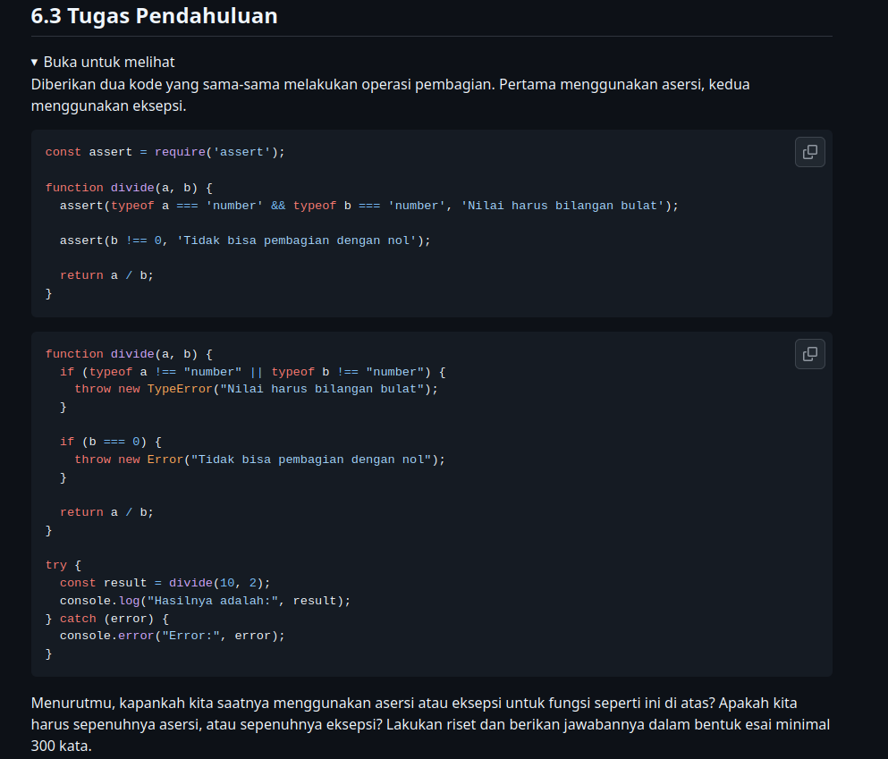

# Tugas Pendahuluan : Design by Contract dan Defensive Programming

**Nama:** Danu Warisman

**NIM:** 103122400041

**Kelas:** SE-08-02

## Soal

Tersedia di [Modul-6](https://github.com/adhiansyahancha/Praktikum-KPL/wiki/Modul-6)

## Jawaban

Dalam pengembangan perangkat lunak, khususnya ketika menerapkan konsep defensive programming, kita sering dihadapkan pada pilihan antara menggunakan asersi atau eksepsi untuk menangani kesalahan input. Ada dua fitur untuk mencapai defensive programming yaitu asersi dan eksepsi. Keduanya melakukan hal yang sama, tetapi lingkupnya berbeda. Berdasarkan contoh fungsi pembagian atau divide pada modul, terdapat dua pendekatan yang ditunjukkan: satu menggunakan asersi dari pustaka bawaan Node.js, dan yang lainnya menggunakan lontaran eksepsi secara manual dengan throw new TypeError. Pertanyaan mengenai kapan saat yang tepat untuk menggunakan masing-masing metode, atau apakah kita harus sepenuhnya asersi atau sepenuhnya eksepsi, dapat dijawab dengan memahami ranah dan tujuan spesifik dari kedua fitur ini.

Pertama-tama, asersi biasanya digunakan dalam pengembangan. Asersi memungkinkan kita melakukan pemastian bahwa data yang kita terima sesuai dengan harapan. Asersi berfungsi untuk mengecek kebenaran asumsi dari seorang programmer dan bertindak sebagai penjaga kontrak internal aplikasi. Jika sebuah asersi gagal, hal itu menandakan adanya bug atau cacat logika di dalam kode yang ditulis oleh pengembang itu sendiri, bukan kesalahan dari sisi pengguna akhir. Misalnya, jika fungsi divide hanya dipanggil secara internal oleh fungsi-fungsi lain di dalam program kita dan kita sudah tahu pasti bahwa inputnya harus berupa angka, asersi sangat cocok digunakan untuk memastikan tidak ada pengembang yang tidak sengaja memasukkan tipe data string ke fungsi tersebut. Di banyak bahasa pemrograman, asersi seringkali dinonaktifkan saat program sudah masuk tahap rilis atau production agar tidak membebani performa aplikasi.

Di sisi lain, eksepsi difungsikan untuk menangani kondisi tidak wajar atau kesalahan yang terjadi saat program sedang berjalan, terutama yang berasal dari faktor eksternal. Eksepsi adalah fitur yang lebih sering digunakan, khususnya ketika sistem menangani proses asinkron yang lumrah dalam sistem yang ingin mengambil data melalui Internet. Jika fungsi divide tersebut dihubungkan ke sebuah antarmuka kalkulator web di mana pengguna bisa saja mengetikkan huruf alih-alih angka, maka pendekatan eksepsi wajib digunakan. Dengan menggunakan eksepsi, program tidak akan langsung mati seketika. Kita bisa menangkap eksepsi tersebut dan memberikan pesan peringatan yang ramah kepada pengguna melalui blok try-catch.

Menjawab pertanyaan apakah kita harus sepenuhnya menggunakan asersi atau sepenuhnya eksepsi: jawabannya adalah tidak. Keduanya bukanlah konsep yang saling menggantikan, melainkan dua fitur dengan lingkup berbeda yang saling melengkapi dalam paradigma defensive programming. Praktik terbaiknya adalah memadukan keduanya sesuai porsinya. Gunakan asersi untuk menangkap kesalahan logika programmer di tahap pengembangan, dan gunakan eksepsi untuk menangani kesalahan saat program berjalan yang berpotensi terjadi saat program berinteraksi dengan dunia luar.

Kesimpulannya, untuk fungsi divide di atas, jika ia bertindak murni sebagai fungsi internal yang ketat, penggunaan asersi sudah cukup baik. Namun, jika fungsi tersebut merupakan bagian dari modul yang akan menerima input dinamis dari luar secara langsung, pendekatan menggunakan eksepsi jauh lebih tangguh karena memfasilitasi penanganan kesalahan yang elegan tanpa merusak alur aplikasi secara keseluruhan.