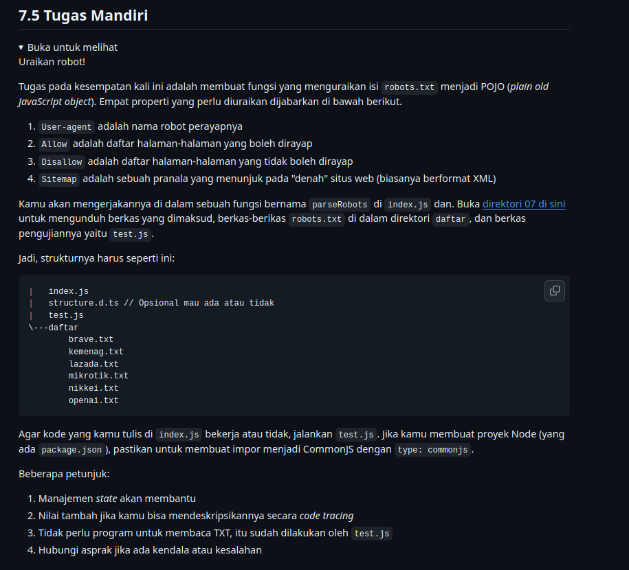
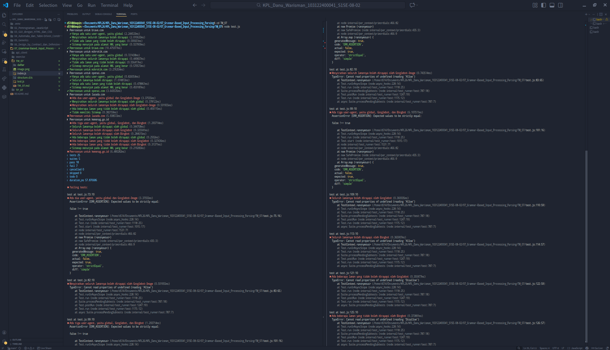
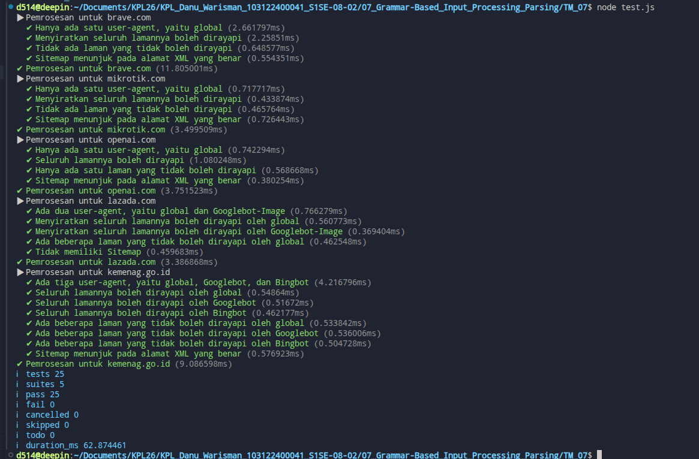

# Tugas Mandiri 07: Grammar-based Input Processing

**Nama:** Danu Warisman

**NIM:** 103122400041

**Kelas:** SE-08-02

## Tugas



## Program/Kode

Tersedia di [index.js](https://github.com/danuwarisman/KPL_Danu_Warisman_103122400041_S1SE-08-02/blob/main/07_Grammar-Based_Input_Processing_Parsing/TM/index.js), [test.js](https://github.com/danuwarisman/KPL_Danu_Warisman_103122400041_S1SE-08-02/blob/main/07_Grammar-Based_Input_Processing_Parsing/TM/test.js), [structure.d.ts](https://github.com/danuwarisman/KPL_Danu_Warisman_103122400041_S1SE-08-02/blob/main/07_Grammar-Based_Input_Processing_Parsing/TM/structure.d.ts), dan [daftar](https://github.com/danuwarisman/KPL_Danu_Warisman_103122400041_S1SE-08-02/tree/main/07_Grammar-Based_Input_Processing_Parsing/TM/daftar).


## Output
Output percobaan pertama

Output finallll jadinya ky gini


## Deskripsi
Pertama, aku bikin variabel result buat nampung hasil akhir. Isinya ada agents (objek kosong) sama Sitemap (array kosong). Terus aku juga bikin currentAgent buat nyimpen user-agent yang lagi diproses. Ini penting soalnya satu file bisa punya banyak user-agent.

Setelah itu, isi file dipecah per baris pake split("\n") terus di-loop satu-satu. Baris yang kosong sama yang diawali # (komentar) aku skip karena bukan aturan robot. Terus aku cari tanda titik dua (:) buat misahin key sama value. Key-nya aku jadiin lowercase biar seragam.

Kalau ketemu user-agent, aku simpen di currentAgent. Terus aku cek, kalau user-agent itu belum ada di agents, aku bikin dulu objeknya dengan Allow: [] dan Disallow: [].

Kalau ketemu allow atau disallow, aku push valuenya ke array milik currentAgent, asalkan valuenya nggak kosong.

Kalau ketemu sitemap, aku push langsung ke array result.Sitemap.

Terus buat host aku juga sempet bikin pengecekannya, nanti disimpen di result.Host.

Nah, setelah kode awal ini dijalanin pake test.js, ternyata ada beberapa error.

Pertama, error muncul di pengecekan user-agent. Di test, user-agent dicek pake huruf kecil semua kayak 'googlebot-image' dan 'bingbot', sedangkan di file aslinya ada yang pake huruf besar. 
Akhirnya aku ubah bagian ini
```
      // currentAgent = value; ~ jadi ini yg ku ganti ke yg dibawah e
      currentAgent = value.toLowerCase();
```      

Kedua, sitemap di beberapa file muncul sebelum user-agent, jadi nggak keproses karena kodeku sebelumnya cuma ngecek sitemap kalau currentAgent udah ada. Akhirnya aku pindahin pengecekan sitemap ke atas sebelum ngecek currentAgent.

Ketiga, aku hapus bagian host karena ternyata test nggak ngecek properti itu sama sekali. Jadi biar simpel aja.

Setelah tiga perubahan itu, semua test akhirnya lolos.