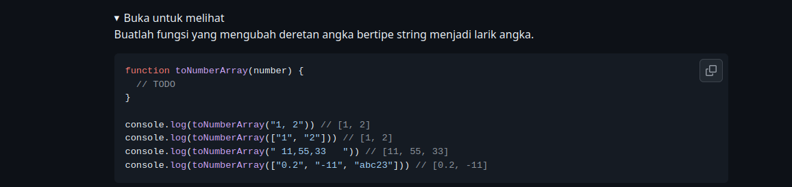
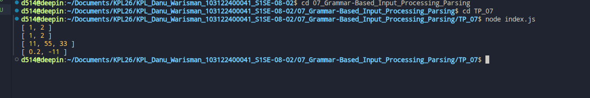

# Tugas Pendahuluan 07: Grammar-based Input Processing

**Nama:** Danu Warisman

**NIM:** 103122400041

**Kelas:** SE-08-02

## Tugas



## Program/Kode

Tersedia di [index.css](https://github.com/danuwarisman/KPL_Danu_Warisman_103122400041_S1SE-08-02/blob/main/07_Grammar-Based_Input_Processing_Parsing/TP/index.css).

## Output



## Deskripsi
Pertama, cek dulu tipe data dari parameter number. Kalau tipenya string, aku pecah pake split(",") biar jadi array. Kalau udah array, langsung aja dipake.
```
let arr;

if (typeof number === "string") {
arr = number.split(",");
} else {
arr = number;
}
```
Selanjutnya, aku bikin array kosong hasil buat nampung angka-angkanya. Terus aku looping pake for biasa buat ngolah satu-satu elemennya.

Di dalem loop, aku pake String(arr[i]).trim() buat ngilangin spasi yang nggak perlu di depan atau belakang string. Habis itu aku ubah ke angka pake parseFloat(), soalnya ada input yang pake desimal juga kaya "0.2".
```
let bersih = String(arr[i]).trim();
let angka = parseFloat(bersih);
```
Nah, biar yang bukan angka kaya "abc23" nggak ikut masuk ke hasil akhir, aku cek pake isNaN(angka). Kalau hasilnya false yang berarti itu angka beneran, baru aku push ke array hasil.
~~~
if (!isNaN(angka)) {
hasil.push(angka);
}
~~~
Terakhir tinggal return hasil dan fungsinya udah bisa dipake sesuai contoh yang dikasih.