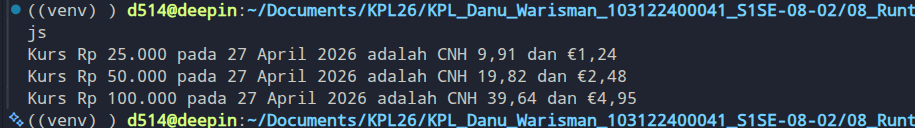

# Tugas Mandiri 08: Runtime Configuration dan Internationalization

**Nama:** Danu Warisman

**NIM:** 103122400041

**Kelas:** SE-08-02

## Tugas

## Program/Kode

Tersedia di [index.js](https://github.com/danuwarisman/KPL_Danu_Warisman_103122400041_S1SE-08-02/blob/main/08_Runtime_Configuration_dan_Internationalization/TM/index.js),

## Output

## Deskripsi
Pertama, aku bikin file .env buat nyimpen URL API ke dalam variabel BASE_API. Ini sesuai dengan tantangan pertama biar link API nggak ditulis langsung (di-hardcode) di dalam kodenya.

Setelah itu, di file index.js, aku panggil package @dotenvx/dotenvx dan nambahin konfigurasi { quiet: true }. Ini untuk nyelesaiin tantangan ketiga, yaitu menyembunyikan pesan promosi "injected env..." dari dotenvx biar terminalnya bersih waktu program dijalankan.

Terus, aku bikin fungsi asynchronous tampilkanKurs() buat nge-fetch data dari API yang URL-nya diambil dari .env tadi. Data JSON-nya di-parse, lalu aku ambil nilai rate untuk cnh sama eur yang ada di dalam objek data.idr.

Untuk nyelesaiin tantangan kedua, aku pakai fungsi bawaan JavaScript yaitu Intl. Tanggal saat ini diformat pakai Intl.
DateTimeFormat dengan locale id-ID biar formatnya jadi bahasa Indonesia (misal: 23 April 2026). Untuk nilai uangnya, aku pakai Intl.NumberFormat dengan style: 'currency'. Rupiah (IDR) diset dengan nilai maksimal desimal 0 biar nggak ada koma. Untuk Renminbi (CNH), aku pakai currencyDisplay: 'code' biar muncul teks "CNH", dan untuk Euro (EUR) aku pakai currencyDisplay: 'symbol' biar langsung muncul logo euro "€".

Terakhir, aku masukin nilai yang mau diuji (25000, 50000, 100000) ke dalam array dengan nama variabel params supaya sesuai dengan format requirement modul. Array params ini lalu di-looping pakai forEach. Di dalam loop, hasil perkalian nilai tukar dihitung dan string outputnya digabungkan lalu ditampilkan pakai console.log. Kodenya berjalan lancar dan outputnya sudah sesuai dengan format yang diminta di soal.
