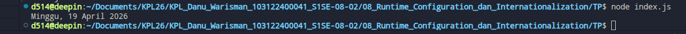

# Tugas Pendahuluan 08: Runtime Configuration dan Internationalization

**Nama:** Danu Warisman

**NIM:** 103122400041

**Kelas:** SE-08-02

## Tugas

## Program/Kode

Tersedia di [index.css](https://github.com/danuwarisman/KPL_Danu_Warisman_103122400041_S1SE-08-02/blob/main/08_Runtime_Configuration_dan_Internationalization/TP/index.css).

## Output

## Deskripsi
Dengan menggunakan objek Intl.DateTimeFormat, JavaScript menyediakan cara yang mudah dan konsisten untuk melakukan internasionalisasi format tanggal tanpa perlu membuat array nama hari/bulan secara manual. Hal ini sangat berguna ketika aplikasi perlu mendukung berbagai bahasa dan wilayah (locale) yang berbeda-beda.