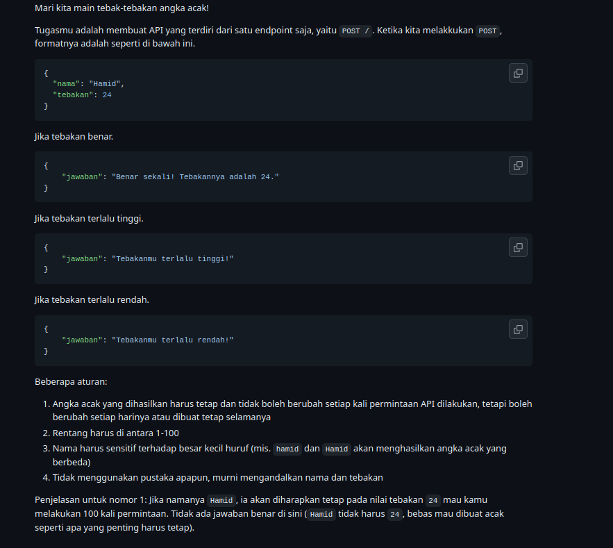
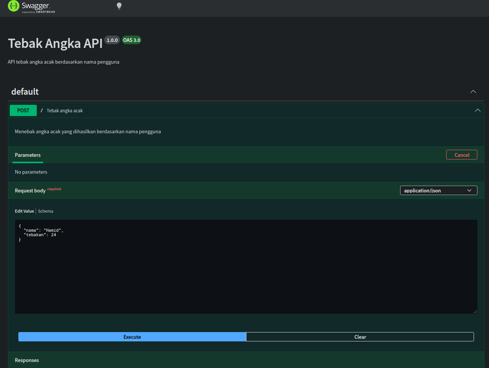
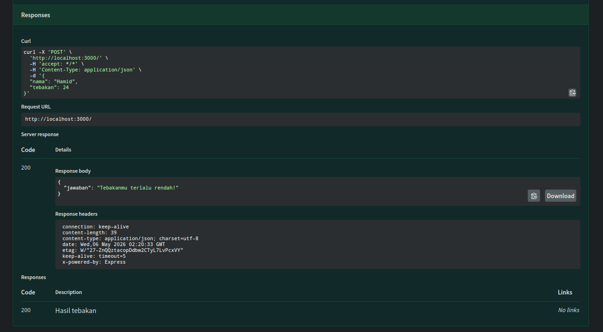

# Tugas Mandiri 09: API Design dan Construction Using Swagger
**Nama:** Danu Warisman  
**NIM:** 103122400041  
**Kelas:** SE-08-02

## Tugas

## Program/Kode
Tersedia di [index.js](https://github.com/danuwarisman/KPL_Danu_Warisman_103122400041_S1SE-08-02/blob/main/09_API_Design_dan_Construction_Using_Swagger/TM/index.js).

## Output

## Deskripsi
Pada tugas ini diminta untuk membuat API tebak angka dengan satu endpoint POST /. Tantangan utamanya ada di aturan bahwa angka acak harus tetap konsisten untuk nama yang sama di setiap request, case-sensitive, dan tidak boleh menggunakan library apapun.

Karena tidak boleh pakai library, angka tidak bisa di-generate secara acak biasa menggunakan Math.random() karena hasilnya berubah setiap dipanggil. Solusinya adalah membuat fungsi hash sederhana yang mengubah nama menjadi angka secara deterministik. Setiap karakter dari nama diambil nilai ASCII-nya menggunakan charCodeAt(), lalu dikalikan dengan bilangan prima 31 secara berulang. Hasil akhirnya dimodulo 100 dan ditambah 1 agar masuk ke rentang 1-100. Karena prosesnya hanya bergantung pada karakter nama, hasilnya selalu sama untuk nama yang sama dan otomatis berbeda untuk nama yang berbeda huruf besar kecilnya.

Setelah angka rahasia didapat, logika perbandingannya cukup straightforward yaitu membandingkan nilai tebakan dengan angka rahasia dan mengembalikan response yang sesuai. Dokumentasi Swagger juga ditambahkan menggunakan komentar @swagger di atas handler, termasuk mendefinisikan struktur request body agar bisa langsung dicoba lewat /docs.