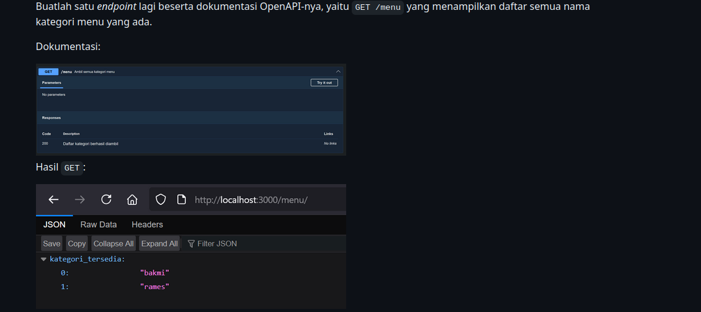
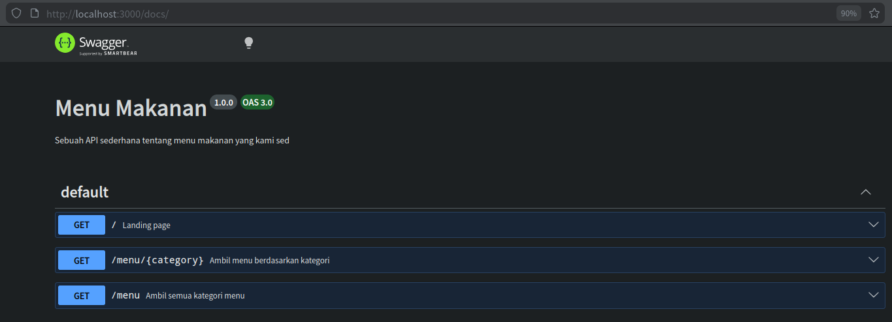
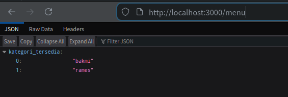

# Tugas Pendahuluan 09: API Design dan Construction Using Swagger

**Nama:** Danu Warisman

**NIM:** 103122400041

**Kelas:** SE-08-02

## Tugas

## Program/Kode

Tersedia di [index.js](https://github.com/danuwarisman/KPL_Danu_Warisman_103122400041_S1SE-08-02/blob/main/09_API_Design_dan_Construction_Using_Swagger/TP/index.js).

## Output

## Deskripsi
Pada tugas ini diminta untuk membuat endpoint GET /menu yang menampilkan daftar semua kategori menu yang tersedia. Karena sebelumnya sudah ada endpoint /menu/:category untuk mengambil menu berdasarkan kategori tertentu, endpoint ini berfungsi sebagai langkah awal agar pengguna tahu kategori apa saja yang bisa diakses.
 
Untuk mengambil daftar kategori, digunakan Object.keys(menuData) yang secara otomatis membaca semua key dari objek data menu. Pendekatan ini lebih fleksibel dibanding hardcode karena jika ada penambahan kategori baru di data, endpoint langsung ikut menyesuaikan tanpa perlu diubah lagi. Hasilnya dikembalikan dalam bentuk objek { kategori_tersedia: [...] } agar struktur response lebih rapi dan mudah dipahami.
 
Untuk bagian dokumentasi, komentar @swagger ditambahkan tepat di atas handler endpoint sesuai format OpenAPI. Dengan begitu, setiap kali server dijalankan, dokumentasi di /docs akan terupdate secara otomatis mengikuti kode yang ada. Pendekatan ini cukup efisien karena dokumentasi dan implementasi berada di satu tempat yang sama.
