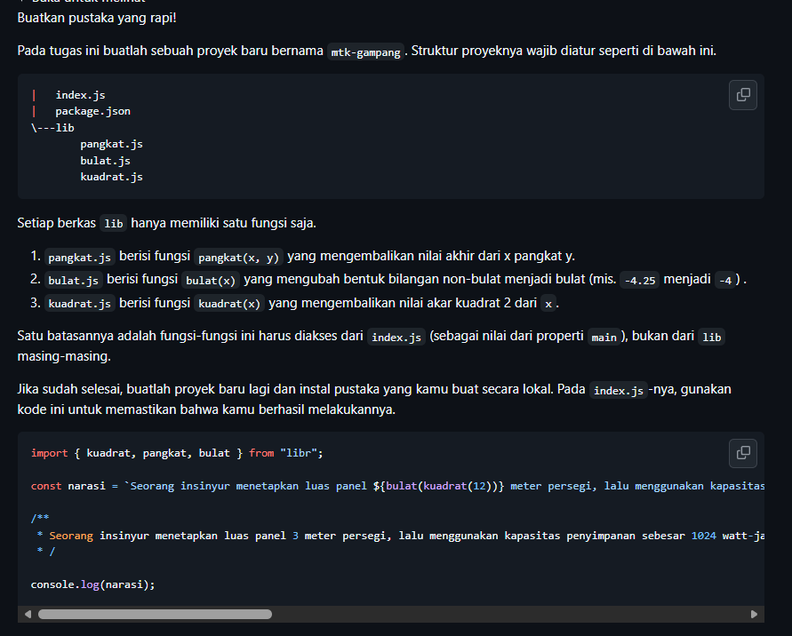
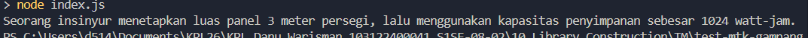

# Tugas Mandiri 10: Library Construction
**Nama:** Danu Warisman  
**NIM:** 103122400041  
**Kelas:** SE-08-02

## Tugas

## Program/Kode
Tersedia di [TM](https://github.com/danuwarisman/KPL_Danu_Warisman_103122400041_S1SE-08-02/blob/main/10_Library_Construction/TM).

## Output

## Deskripsi
Pada tugas ini diminta untuk membuat pustaka bernama mtk-gampang yang menyediakan tiga fungsi matematika yaitu pangkat, bulat, dan kuadrat, lalu membuktikan bahwa pustaka tersebut bisa diinstal dan digunakan dari proyek lain.

Setiap fungsi ditempatkan di file terpisah dalam folder lib agar struktur kode lebih rapi dan setiap file punya tanggung jawab yang jelas. Fungsi pangkat dihitung secara manual menggunakan perulangan untuk menghindari ketergantungan pada Math.pow. Fungsi bulat menggunakan Math.trunc yang memotong bagian desimal ke arah nol, sehingga -4.25 menjadi -4 sesuai contoh di soal. Fungsi kuadrat menggunakan Math.sqrt untuk menghitung akar kuadrat.

Agar semua fungsi bisa diakses dari satu titik masuk, index.js di root proyek menjadi file utama yang melakukan re-export dari masing-masing file di lib. Properti main di package.json memastikan bahwa saat pustaka diinstal dan diimpor, yang terbaca adalah index.js tersebut, bukan file di dalam lib secara langsung.

Untuk memverifikasi bahwa pustaka bisa digunakan dari proyek lain, dibuat proyek terpisah test-mtk-gampang yang menginstal mtk-gampang secara lokal menggunakan npm install. Setelah diinstal, fungsi-fungsinya bisa diimpor langsung menggunakan nama package sesuai nilai name di package.json.