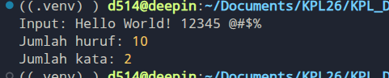

# Tugas Pendahuluan 10: Library Construction
**Nama:** Danu Warisman  
**NIM:** 103122400041  
**Kelas:** SE-08-02

## Tugas
Buka untuk melihat

Buatlah pustaka JavaScript yang menyediakan utilitas berupa dua fungsi yang menghitung jumlah huruf dan jumlah kata.

Kriteria:

    Hanya alfabet A hingga Z yang dihitung (besar dan kecil)
    Spasi tidak dihitung
    Pustaka bisa diimpor

## Program/Kode
Tersedia di [index.js](https://github.com/danuwarisman/KPL_Danu_Warisman_103122400041_S1SE-08-02/blob/main/10_Library_Construction/TP/index.js) dan [test.js](https://github.com/danuwarisman/KPL_Danu_Warisman_103122400041_S1SE-08-02/blob/main/10_Library_Construction/TP/test.js).

## Output

## Deskripsi
Pada tugas ini diminta untuk membuat pustaka JavaScript yang menyediakan dua fungsi utilitas yaitu menghitung jumlah huruf dan jumlah kata dalam sebuah string, dengan ketentuan hanya karakter alfabet A-Z yang dihitung dan pustaka harus bisa diimpor.

Untuk fungsi hitungHuruf, pendekatannya adalah melakukan iterasi tiap karakter dari string input lalu mengecek apakah karakter tersebut masuk ke dalam rentang a-z atau A-Z menggunakan perbandingan langsung. Cara ini dipilih karena tidak memerlukan regex dan cukup eksplisit dalam menggambarkan apa yang sedang dicek. Karakter seperti spasi, angka, dan tanda baca secara otomatis diabaikan karena tidak memenuhi kondisi tersebut.

Untuk fungsi hitungKata, digunakan regex /[a-zA-Z]+/g yang menangkap semua kelompok huruf berurutan dalam string. Hasilnya berupa array yang tinggal dihitung panjangnya. Pendekatan ini secara otomatis menjadikan spasi dan karakter non-alfabet sebagai pemisah kata, sehingga sesuai dengan kriteria yang diminta.

Agar pustaka bisa diimpor, digunakan sintaks export function dari sistem modul ESM dan properti "type": "module" ditambahkan ke package.json. Dengan begitu file ini bisa langsung diimpor menggunakan import dari file lain maupun diinstal sebagai dependensi lokal menggunakan npm install.